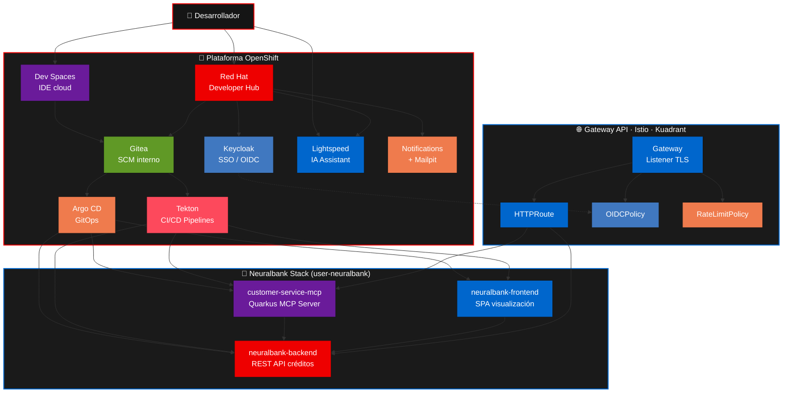
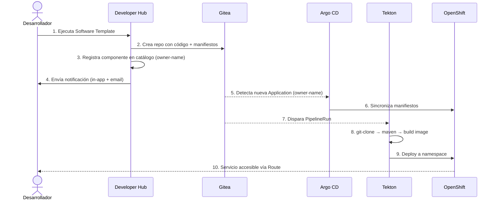
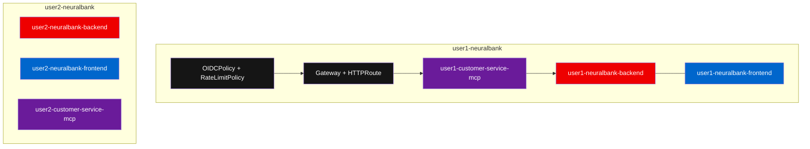
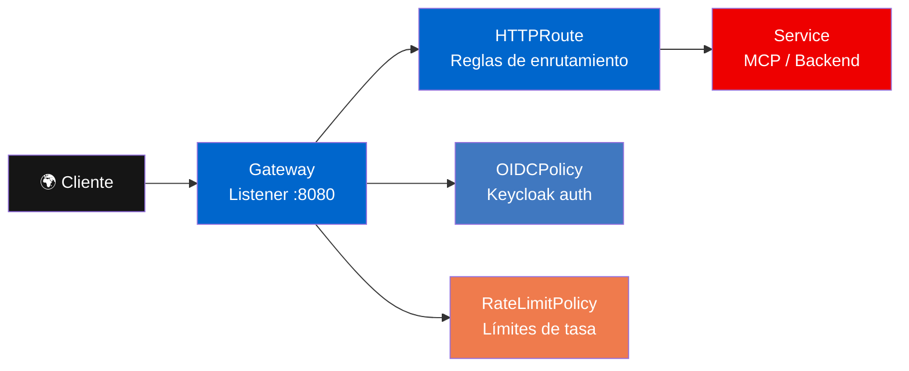

Esta página describe la arquitectura lógica del escenario Neuralbank: cómo encajan Red Hat Developer Hub, GitOps, CI/CD, identidad y exposición segura de APIs frente a un clúster OpenShift.

## Vista de componentes

## Flujo principal: de la plantilla al despliegue

Este patrón une **golden path** (plantilla) con **GitOps** (Argo CD) y **CI/CD** (Tekton), manteniendo trazabilidad desde el primer clic en el Hub hasta el pod en ejecución.

## Namespace por usuario y naming convention

Cada usuario recibe su propio namespace basado en su username. Los componentes en el catálogo y las aplicaciones en ArgoCD usan un **nombre único** con prefijo del owner (`owner-name`) para evitar colisiones entre usuarios:

| Recurso | Convención de nombre | Ejemplo (user1) |
| --- | --- | --- |
| Namespace | `owner-neuralbank` | `user1-neuralbank` |
| Componente en catálogo | `owner-name` | `user1-neuralbank-backend` |
| Aplicación ArgoCD | `owner-name` | `user1-neuralbank-backend` |
| Anotación `backstage.io/kubernetes-id` | `owner-name` | `user1-neuralbank-backend` |
| Anotación `janus-idp.io/tekton` | `owner-name` | `user1-neuralbank-backend` |
| ClusterRoleBinding | `owner-name-trigger-clusterbinding` | `user1-neuralbank-backend-trigger-clusterbinding` |

## Patrón Connectivity Link (Gateway + rutas + políticas)

- **Gateway**: punto de entrada del tráfico (host, listeners, TLS).
- **HTTPRoute**: enlaza hostnames y reglas de enrutamiento con los Services backend.
- **OIDCPolicy**: autenticación OIDC con Keycloak.
- **RateLimitPolicy**: límites de tasa para proteger backends.

## Rol de cada componente

| Componente | Rol |
| --- | --- |
| Developer Hub | Portal del desarrollador: catálogo, plantillas, documentación, notificaciones y plugins hacia GitOps, pipelines y entornos. |
| Gitea | Repositorio Git interno: código fuente, manifiestos y triggers para pipelines. |
| Argo CD | Sincronización continua desde Git al estado del clúster; salud y drift visibles en el dashboard. |
| Tekton | Ejecución de pipelines como recursos de Kubernetes; encadena tareas de CI/CD. Visible en la pestaña **CI** de cada componente en Developer Hub. |
| Keycloak | Identidad y SSO; alimenta políticas OIDC y acceso al Hub. |
| Dev Spaces | Entornos de desarrollo basados en `devfile`, conectados al mismo repo que GitOps y Tekton. |
| Gateway API / Istio / Kuadrant | Entrada norte-sur del tráfico, enrutamiento y políticas (OIDC, rate limit) sobre las APIs expuestas. |
| Lightspeed | Asistente de IA integrado en Developer Hub, con RAG sobre documentación del producto y conexión a LLM vía LiteLLM. |
| Notifications + Mailpit | Sistema de notificaciones in-app y por email; las plantillas notifican automáticamente al crear o eliminar componentes. |

## Lectura para el workshop

Durante los módulos posteriores volverás a este mapa mental: cada vez que crees una plantilla, mira el repo en Gitea; cada vez que sincronice Argo CD, revisa el namespace `YOUR_USER-neuralbank` en OpenShift; cuando el pipeline termine, valida imagen y despliegue; cuando expongas el MCP o APIs, relaciona Gateway, HTTPRoute y políticas con lo que ves en consola y en el catálogo.

Con esta arquitectura, **Developer Hub** actúa como fachada humana sobre un sistema declarativo y automatizado que lleva el software desde el repositorio hasta producción de forma repetible.
