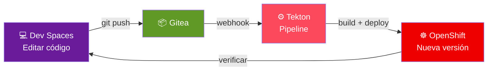

Este módulo muestra el ciclo **editar en IDE web → commit en Gitea → pipeline Tekton → nuevo despliegue**, usando **Red Hat OpenShift Dev Spaces** y el componente **neuralbank-backend** que creaste con plantillas.



## Abrir el componente en Developer Hub

1. Inicia sesión en **Developer Hub**.
2. Busca **YOUR_USER-neuralbank-backend** en el **Catalog** y abre su página.

Si el taller habilita el enlace directo:

- Pulsa **Open in Dev Spaces** (o la acción equivalente del plugin).

Si no aparece el botón:

- Copia la **URL del repositorio** en Gitea desde la ficha del componente.
- Abre **Dev Spaces** en otra pestaña y crea o abre un **Workspace** desde esa URL.

```bash
Developer Hub -> Componente neuralbank-backend -> Open in Dev Spaces
   (alternativa) DevSpaces -> Add workspace -> URL del repo Gitea
```

> **Note:** El workspace debe usar el `devfile.yaml` generado por la plantilla para tener las mismas herramientas (JDK, Maven, extensiones) que espera el pipeline.

## Esperar el arranque del workspace

1. Espera a que el **DevWorkspace** pase a estado **Running**.
2. Abre el IDE en el navegador (VS Code–based u otro según configuración).

Si el arranque falla por cuotas o permisos, revisa el mensaje en la consola de Dev Spaces o pide ayuda al instructor.

## Realizar un cambio de código

En el explorador de archivos del IDE, localiza un recurso REST sencillo del backend (por ejemplo una clase `*Resource.java` bajo el paquete de la API).

Realiza un cambio acotado y seguro, por ejemplo:

- Añadir un nuevo endpoint `GET` de prueba que devuelva un mensaje identificable (`/api/hello-workshop`), **o**
- Modificar el cuerpo de respuesta de un endpoint existente para incluir una cadena reconocible (sin romper contratos que use el frontend).

Guarda los archivos modificados.

> **Warning:** Evita cambiar nombres de artefacto, Dockerfile o rutas de pipeline salvo que el taller lo pida; pequeños cambios en código o mensajes son suficientes para demostrar CI/CD.

## Compilar localmente en el workspace

Abre una terminal en Dev Spaces y ejecuta el empaquetado Maven del proyecto:

```bash
cd /projects/neuralbank-backend   # ajusta la ruta si el clone usa otro nombre
mvn -q package -DskipTests
```

Corrige errores de compilación antes de continuar; el pipeline remoto fallará con los mismos problemas.

> **Note:** Si `mvn` no está en el PATH, usa la tarea **Maven** del IDE o el contenedor definido en el `devfile` según la documentación del entorno.

## Commit y push a Gitea

Desde la terminal o la vista de control de código fuente del IDE:

```bash
git status
git add files-changed
git commit -m "workshop: cambio demo desde Dev Spaces"
git push origin main   # main o master según el repo
```

Si Git pide credenciales, usa el mecanismo del taller (token, SSO o credenciales embebidas en Dev Spaces).

## Observar el pipeline Tekton

1. Ve a **OpenShift Console -> Pipelines -> PipelineRuns** en el proyecto **`YOUR_USER-neuralbank`**.
2. Identifica una nueva ejecución disparada por el **push** reciente.

Abre los logs de las tareas (`git-clone`, `maven-build`, `build-image`, `deploy`) y confirma que la imagen nueva se construye y se despliega.

> **Note:** Algunos entornos usan webhooks explícitos; otros hacen polling. Si el pipeline no arranca en unos minutos, revisa eventos en Gitea y la configuración del trigger.

## Verificar el despliegue de la nueva versión

1. En **Workloads -> Pods**, comprueba que el Deployment realizó un **rollout** (nuevos pods con timestamp reciente).
2. Opcional: inspecciona la **image digest** o etiqueta en el Deployment para confirmar que apunta al build nuevo.

Prueba de nuevo los endpoints en la **Route** pública:

```bash
curl -sk "https://YOUR_ROUTE_HOST/api/your-modified-endpoint"
```

Deberías ver reflejado el cambio (nuevo JSON, mensaje distinto, etc.).

## Verificar el pipeline desde Developer Hub

Además de verificar desde la consola de OpenShift, puedes seguir el pipeline directamente desde Developer Hub:

1. Abre la ficha de **YOUR_USER-neuralbank-backend** en el catálogo.
2. Selecciona la pestaña **CI** para ver el PipelineRun disparado por tu push.
3. Verifica que todas las tareas finalizan en **Succeeded**.

## Cierre del flujo

Has demostrado el ciclo completo **Dev Spaces → Git → Tekton → OpenShift**, alineado con **GitOps** y con la ficha del componente en **Developer Hub**. Pudiste seguir el pipeline tanto desde la consola de OpenShift como desde la pestaña **CI** del componente en Developer Hub. Este es el modelo de trabajo que las organizaciones buscan al adoptar Developer Hub: el desarrollador permanece en un entorno coherente mientras la plataforma aplica estándares y automatización.
