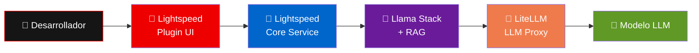
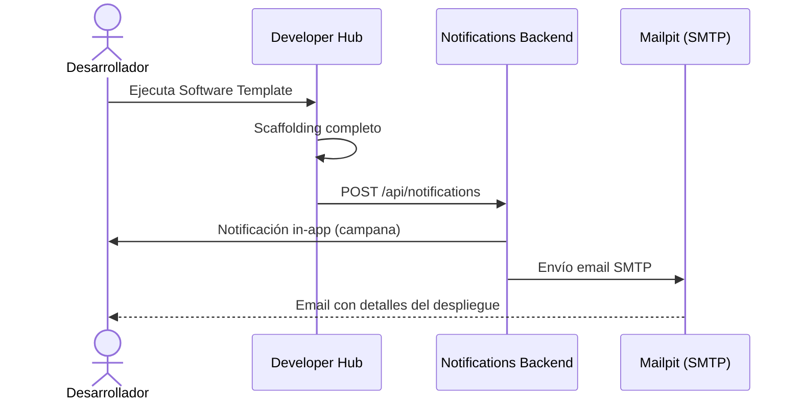

Este módulo presenta dos capacidades integradas en Developer Hub que mejoran la experiencia del desarrollador: **Red Hat Developer Lightspeed** como asistente de IA y el sistema de **Notificaciones** para visibilidad sobre el ciclo de vida de componentes.

## Red Hat Developer Lightspeed

Lightspeed es un asistente de IA integrado directamente en Developer Hub. Permite realizar consultas en lenguaje natural sobre la plataforma, las plantillas, las mejores prácticas y la documentación del producto.

### Acceder a Lightspeed

1. Inicia sesión en **Developer Hub**.
2. En el menú lateral izquierdo, localiza el icono de **Lightspeed** (chat de IA).
3. Se abre una interfaz de conversación donde puedes escribir preguntas.

```bash
Developer Hub -> Menú lateral -> Lightspeed
```

### Probar consultas

Lightspeed incluye prompts sugeridos para empezar. Prueba alguno de estos:

| Pregunta sugerida | Qué obtendrás |
| --- | --- |
| "Can you guide me through the first steps to start using Red Hat Developer Hub as a developer?" | Guía introductoria sobre el portal, catálogo y plantillas |
| "How do I create and use Software Templates in Red Hat Developer Hub?" | Explicación del flujo de scaffolding y golden paths |
| "What components make up the Neuralbank financial platform and how do they interact?" | Descripción de la arquitectura backend, frontend y MCP |
| "How are Tekton pipelines configured for CI/CD in this Developer Hub instance?" | Detalles de la configuración de pipelines y triggers |

También puedes hacer preguntas específicas sobre tu entorno:

```
¿Cómo puedo ver los pipelines de mi componente en Developer Hub?
¿Qué hace la OIDCPolicy en el patrón de connectivity link?
¿Cómo funciona el flujo GitOps con ArgoCD en este workshop?
```

### Arquitectura de Lightspeed



Lightspeed funciona con tres componentes que se ejecutan como sidecars junto al backend de Developer Hub:

- **Lightspeed Core Service**: orquesta las solicitudes entre el frontend y los modelos de IA.
- **Llama Stack**: gestiona el acceso a modelos y la base de datos vectorial con documentación del producto (RAG), proporcionando respuestas contextualizadas.
- **LiteLLM**: proxy que gestiona las conexiones a los modelos de lenguaje disponibles.

> **Note:** Las respuestas de Lightspeed están enriquecidas con documentación oficial de Red Hat Developer Hub gracias al sistema RAG (Retrieval-Augmented Generation).

## Sistema de notificaciones

Developer Hub incluye un sistema de notificaciones que mantiene informados a los desarrolladores sobre eventos de la plataforma.

### Notificaciones in-app

1. En la barra superior de Developer Hub, localiza el icono de **campana** (notificaciones).
2. Haz clic para ver las notificaciones recibidas.
3. Cada notificación incluye título, descripción, enlace al componente y nivel de severidad.

Las plantillas del workshop envían notificaciones automáticas en dos escenarios:

| Evento | Severidad | Ejemplo de mensaje |
| --- | --- | --- |
| Componente creado exitosamente | Normal | "Neuralbank Backend deployed successfully — YOUR_USER-neuralbank-backend creado en namespace YOUR_USER-neuralbank" |
| Componente eliminado (cleanup) | High | "Component removed from platform — YOUR_USER-neuralbank-backend eliminado junto con ArgoCD Application, repositorio y namespace" |

### Notificaciones por email

Además de las notificaciones in-app, el sistema envía emails a la dirección registrada en Keycloak para tu usuario. En el entorno del workshop, los emails se capturan con **Mailpit**, un servidor SMTP de pruebas.

Para verificar los emails recibidos:

1. Identifica la dirección email asociada a tu usuario en Keycloak (generalmente `YOUR_USER@example.com` o similar).
2. Accede a la interfaz web de **Mailpit** (consulta la URL con el instructor).
3. Verás los correos enviados por `devhub@neuralbank.io` con detalles del componente creado o eliminado.

### Flujo de notificaciones



## Probar el flujo completo

Para verificar ambas funcionalidades en una sola actividad:

1. **Pregunta a Lightspeed**: "How do I remove a component from the platform?" para entender el proceso de cleanup.
2. Si ya desplegaste los tres componentes, usa la plantilla **Remove Component (Cleanup)** para eliminar uno de ellos.
3. Verifica que recibes una **notificación in-app** con severidad alta indicando la eliminación.
4. Revisa en **Mailpit** el email correspondiente.
5. Vuelve a **Lightspeed** y pregunta sobre el estado actual de tus componentes.

## Resumen

Has explorado **Lightspeed** como asistente de IA integrado en Developer Hub, capaz de responder preguntas sobre la plataforma con contexto RAG, y el sistema de **Notificaciones** que proporciona visibilidad en tiempo real (in-app y por email) sobre el ciclo de vida de los componentes. Estas capacidades refuerzan la propuesta de Developer Hub como **portal integral** que no solo automatiza, sino que informa y asiste al desarrollador durante todo el flujo de trabajo.
