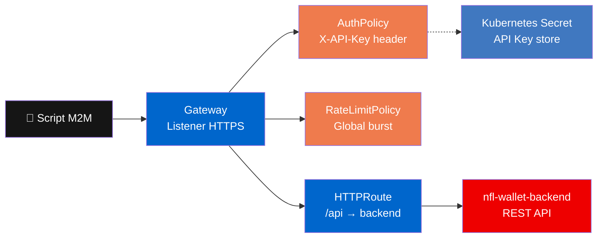

En este módulo explorarás cómo **Red Hat Connectivity Link** protege la API de NFL Wallet con **AuthPolicy** basada en **API Key**, un modelo diferente al OIDC, ideal para integraciones máquina-a-máquina (M2M).

## Arquitectura del patrón API Key



## OIDC vs API Key

| Aspecto | Neuralbank (OIDC) | NFL Wallet (API Key) |
|---------|-------------------|---------------------|
| **Auth** | Token JWT (Bearer) via Keycloak | API Key estática (header) |
| **Flujo** | Redirect a login page | Sin redirect, key directa |
| **Caso de uso** | Usuarios interactivos (web) | Integraciones M2M, scripts |
| **Header** | `Authorization: Bearer <token>` | `X-API-Key: <key>` |
| **Rate limit** | Por usuario autenticado | Global (todas las keys) |

## Inspeccionar recursos

```bash
oc get gateway,httproute,authpolicy,ratelimitpolicy -n nfl-wallet-prod
```

## Probar sin API Key

```bash
NFL_HOST=$(oc get httproute -n nfl-wallet-prod -o jsonpath='{.items[0].spec.hostnames[0]}')
curl -sk "https://$NFL_HOST/api/teams" -w "\nHTTP %{http_code}\n"
```

Resultado: **401 Unauthorized**.

## Probar con API Key

```bash
API_KEY=$(oc get secret nfl-api-key-1 -n nfl-wallet-prod -o jsonpath='{.data.api_key}' | base64 -d)
curl -sk "https://$NFL_HOST/api/teams" -H "X-API-Key: $API_KEY" | python3 -m json.tool | head -20
```

Resultado: **200 OK** con datos de equipos NFL.

## Probar rate limit

```bash
for i in $(seq 1 25); do
  curl -sk -o /dev/null -w "%{http_code} " "https://$NFL_HOST/api/teams" -H "X-API-Key: $API_KEY"
done
echo
```

Verás `200` repetido hasta alcanzar el límite, luego **429 Too Many Requests**.

## Verificar en Developer Hub

1. Navega a **APIs** → busca **NFL Wallet API**.
2. El **APIProduct** de Kuadrant muestra el estado Published.
3. Explora el OpenAPI spec y los planes de consumo.
