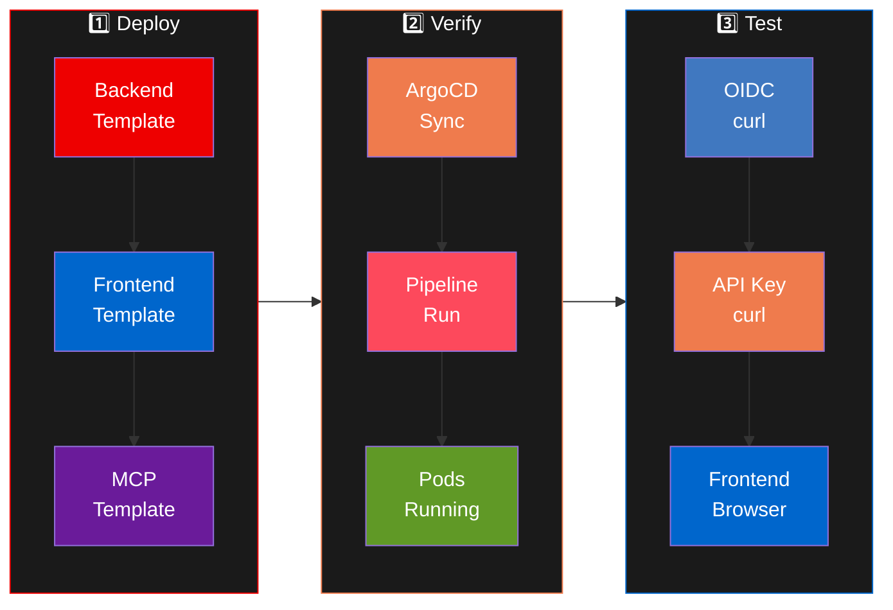

Actividad práctica consolidada: despliega el stack Neuralbank completo y verifica que todo funcione.

## Flujo completo



## Step 1: Deploy Backend

1. Abre **Developer Hub** → **Create** → selecciona **"Neuralbank: Backend API"**.
2. Completa: **Name** = `neuralbank-backend`, **Owner** = `YOUR_USER`.
3. Click **Create** y espera que completen todos los pasos.

## Step 2: Deploy Frontend

1. **Create** → **"Neuralbank: Frontend"**.
2. **Name** = `neuralbank-frontend`, **Owner** = `YOUR_USER`.

## Step 3: Deploy Customer Service MCP

1. **Create** → **"Customer Service MCP"**.
2. **Name** = `customer-service-mcp`, **Owner** = `YOUR_USER`.

## Step 4: Verificar en ArgoCD

```bash
oc get applications -n openshift-gitops | grep YOUR_USER
```

Las tres aplicaciones deben mostrar `Synced` y `Healthy`.

## Step 5: Verificar pipelines

```bash
oc get pipelinerun -n YOUR_USER-neuralbank
```

## Step 6: Test OIDC (Neuralbank)

Referencia completa en el módulo [Connectivity Link: OIDC](10-explore-connectivity-link-oidc.html).

```bash
NEURALBANK_HOST=$(oc get httproute -n neuralbank-stack -o jsonpath='{.items[0].spec.hostnames[0]}')
KC_HOST="https://rhbk.YOUR_CLUSTER_DOMAIN"

TOKEN=$(curl -sk "$KC_HOST/realms/neuralbank/protocol/openid-connect/token" \
  -d "client_id=neuralbank" -d "username=robert.anderson@email.com" \
  -d "password=Welcome123" -d "grant_type=password" \
  | python3 -c "import json,sys; print(json.load(sys.stdin)['access_token'])")

curl -sk "https://$NEURALBANK_HOST/api/v1/customers" \
  -H "Authorization: Bearer $TOKEN" | python3 -m json.tool | head -10
```

## Step 7: Test API Key (NFL Wallet)

Referencia completa en el módulo [Connectivity Link: API Key](11-explore-connectivity-link-apikey.html).

```bash
NFL_HOST=$(oc get httproute -n nfl-wallet-prod -o jsonpath='{.items[0].spec.hostnames[0]}')
API_KEY=$(oc get secret nfl-api-key-1 -n nfl-wallet-prod -o jsonpath='{.data.api_key}' | base64 -d)

curl -sk "https://$NFL_HOST/api/teams" -H "X-API-Key: $API_KEY" | python3 -m json.tool | head -10
```

## Step 8: Verificar frontend

Abre en el browser: `https://neuralbank.YOUR_CLUSTER_DOMAIN`

## Step 9: Explorar en Developer Hub

1. **Catalog** → busca tus componentes `YOUR_USER-*`.
2. Verifica las pestañas: **CI** (pipelines), **CD** (ArgoCD), **Topology**, **Kubernetes**, **API**, **Docs**.
3. Revisa las **Notificaciones** (campana) y los emails en **Mailpit**.
4. Prueba **Lightspeed**: pregunta sobre tus componentes.
